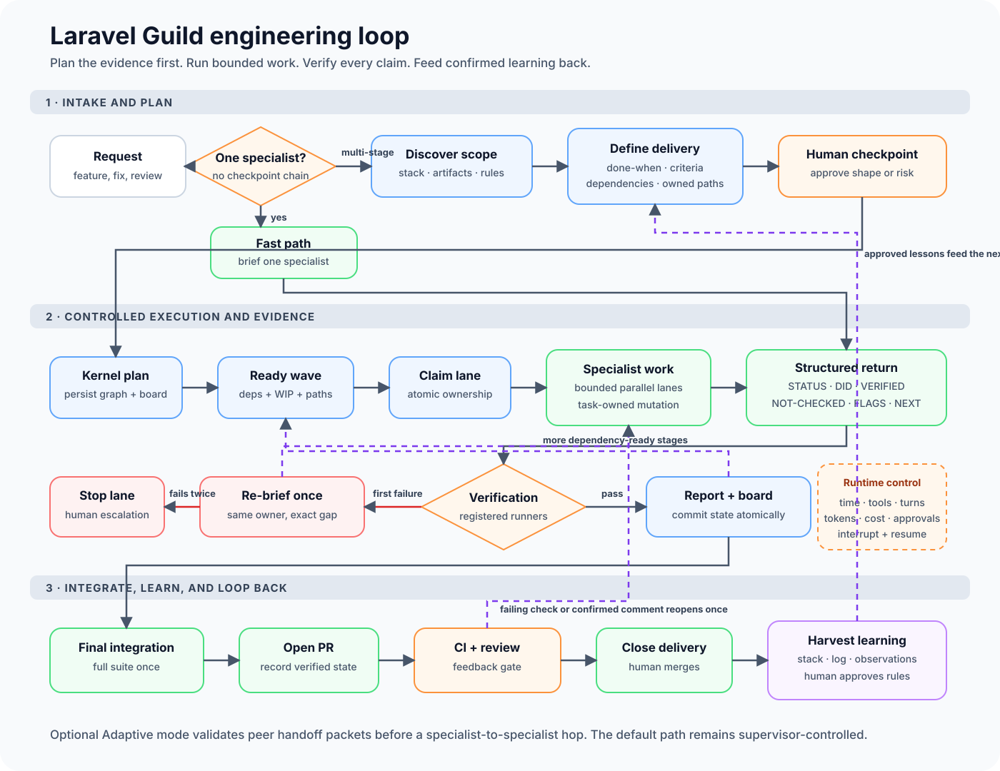

# Laravel Guild — the 18-Agent Claude Code Team for Laravel

**A guild of 18 master craftspeople for your Laravel codebase.** A production-grade, drop-in team of Claude Code subagents purpose-built for **Laravel** projects. Covers the full lifecycle — discovery, prioritization, architecture, design, frontend (Blade / Livewire / Inertia / Filament), backend (Eloquent / Form Requests / Policies / API Resources), database, mobile, QA (Pest / PHPUnit / Dusk), DevOps (Forge / Vapor / Envoyer / Kamal), security, performance, technical writing, tech leadership, scrum, package development, and end-to-end delivery coordination.

Installable as a **Claude Code plugin** (one command), a **Cursor plugin**, a **Gemini CLI extension**, or a **Codex CLI** target, or via the classic `install.sh`. Guardrail hooks are tested in CI.

Every agent now knows what "good" looks like in a Laravel codebase. Reviewers refuse antipatterns (`env()` outside config, N+1, mass-assignment gaps, missing Policies, `migrate:fresh` anywhere near production). Builders default to idiomatic Laravel.

Adopting a team? [Run your first delivery](docs/onboarding.md). Mapping `docs/`? [Where does each document live?](docs/README.md).

---

## Five-minute quickstart

Install the plugin, run one command, watch the team work. Every install flavour and the design notes sit [below](#install).

### 1. Install

In Claude Code, from a Laravel project:

```
/plugin marketplace add HamzaAlayed/laravel-claude-agents
/plugin install laravel-team@laravel-claude-agents
```

That is the recommended path. Cursor, Gemini, Codex, `install.sh`, and skills-only installs are under [Install](#install).

### 2. First command

```
/make-feature Donation --api
```

`--api` skips the frontend stage. Or open the browser board first:

```
/console
```

`/console` starts `scripts/console/serve.py` (Python 3.10+, default port 8378) and prints a tokenized URL. A URL without the token will not work.

### 3. What you see

A progress board after the plan and after every stage — header first, so you can still act. Format is the Interface block in `commands/make-feature.md`:

```
N stages · done when: POST /api/donations creates a Donation
▶ a  database-developer   writing the migration
· b  backend-developer
· d  qa-engineer
·    tech-lead
```

Statuses are `✔ done / ▶ running / · queued / ✖ failed / ⚠ interrupted / ⛔ budget exceeded`. Each specialist returns `STATUS / DID / VERIFIED / NOT-CHECKED / FLAGS / NEXT`. After two or more specialists report, `docs/team/stack.md` and `docs/delivery/<name>/log.md` exist before the closing answer.

In `/console`, stations take the dark floor as the company starts. A parked agent is marked on the floor (cue / needs you). New runs default to **Work independently**: edits and a narrow set of routine checks continue automatically in trusted projects. Other shell commands still ask. Choose **Ask me** to retain approval for every Bash call. See [independent runs and project preferences](docs/independent-runs.md).

Console runs have hard default ceilings (30 minutes, 200 tool calls, 120
assistant turns, 5M tokens, $10 estimated/actual spend), with lower per-run
overrides accepted in the launch spec. A breach denies the next tool,
interrupts the SDK run, and emits a
`budget_exceeded` event. Run metadata is checkpointed before execution, so an
interrupted historical run can resume as a new run via
`POST /api/runs/<run_id>/resume` after inspecting the current workspace and
kernel state.

Persisted JSONL is a bounded diagnostic trace, not a permanent memory store:
raw SDK messages are omitted by default, secret-shaped fields and values are
redacted, long values and files are capped,
every event carries trace/span correlation IDs, and startup retains at most 100
runs for 14 days. Set narrower limits by constructing `RunManager` with the
retention options; do not use traces as an authority source.


Fixture-driven capture of the Guild console company floor (Adam + Dina, parked cue) — not a billed live `/console` run.

---

## What's in here

```
.claude/
├── agents/
│   ├── business-analyst.md       # "Sara" — discovery & requirements (Sonnet, project memory)
│   ├── product-owner.md          # "Hana" — backlog & prioritization (Sonnet, project memory)
│   ├── ui-ux-designer.md         # "Bruno" — paradigm-aware design specs (Sonnet, project memory)
│   ├── frontend-developer.md     # "Bella" — Blade/Livewire/Inertia/Filament (Sonnet)
│   ├── backend-developer.md      # "Adam" — APIs, services, Eloquent (Sonnet)
│   ├── database-developer.md     # "Elena" — migrations, indexes, factories (Sonnet, project memory)
│   ├── package-developer.md      # "Clara" — Laravel package authoring (Sonnet, project memory)
│   ├── qa-engineer.md            # "Dina" — Pest/PHPUnit/Dusk, fakes (Sonnet)
│   ├── devops-engineer.md        # "Farid" — Forge/Cloud/Octane/Horizon (Sonnet)
│   ├── scrum-master.md           # "Petra" — delivery rhythm & blockers (Haiku, project memory)
│   ├── solution-architect.md     # "Bilal" — system design & ADRs (Opus, project memory)
│   ├── security-engineer.md      # "Felix" — STRIDE + Laravel hardening (Opus, project memory, no Edit/Write)
│   ├── technical-writer.md       # "Sofia" — Scribe, route:list-driven docs (Sonnet)
│   ├── tech-lead.md              # "Tariq" — code review w/ Laravel checklist (Opus 4.8, project memory, no Edit/Write)
│   ├── performance-engineer.md   # "Omar" — profiling, N+1, caching, Octane, CWV (Opus 4.8, project memory, no Edit/Write)
│   ├── mobile-developer.md       # "Pablo" — iOS/Android consuming Laravel APIs (Sonnet)
│   └── delivery-coordinator.md   # "Emre" — orchestrator main-thread agent (Sonnet, project memory)
│
└── commands/
    ├── audit-n-plus-one.md       # Audit a route/component for N+1, hand fixes to backend
    ├── make-feature.md           # End-to-end feature scaffold across DB → API → UI → QA → review
    ├── add-policy.md             # Add a Policy + patch all touch points + tests
    ├── refactor-to-action.md     # Extract a fat controller method into an Action class
    ├── ship-checklist.md         # Pre-release verification → SHIP / HOLD / CONDITIONAL verdict
    ├── add-test.md               # Generate a test plan + tests for a class/route/component
    ├── review-pr.md              # Layered diff review → tech-lead + security + QA + perf
    ├── audit-agents.md           # Audit the pack's own orchestration contract — Interface placement, tool grants, artifact routing, read-only enforcement
    ├── optimize-query.md         # Diagnose a slow query/endpoint, route fixes to owners
    ├── upgrade-laravel.md        # Staged Laravel version-upgrade plan
    ├── teach.md                  # Record a user-taught rule all agents apply from then on
    ├── team-hygiene.md           # Consolidate docs/team/ — dupes, conflicts, stale facts
    ├── board.md                  # Open the live agents dashboard (serves board.html)
    ├── console.md                # Open the Guild web console (React board, approvals, interrupt)
    ├── sprint.md                 # Start, inspect, or close an optional sprint
    └── pair.md                   # Hold one stage until a reviewer command exits 0

scripts/
├── block-prod-destructive-sql.sh # Block DROP/TRUNCATE/unscoped DELETE/UPDATE
├── block-prod-artisan.sh         # Block migrate:fresh, db:wipe, tinker, etc. against prod
├── enforce-reviewer-readonly.sh  # Block file-mutating Bash from the read-only reviewers
├── enforce-agent-paths.sh        # Keep planned native writes inside claimed owned paths
├── enforce-agent-paths.py        # Registry-backed native-write policy engine
├── enforce-kernel-approvals.sh   # Require user approval + claim before planned work
├── enforce-kernel-approvals.py   # Durable approval and kernel-state policy engine
├── enforce-kernel-budgets.sh     # Meter stages and stop exact repeated tool cycles
├── enforce-kernel-budgets.py     # Persist usage, enforce budgets, and detect loops
├── guild-kernel/                 # Durable orchestration state machine and CLI
├── outcome-benchmark.py          # Compare read-only performance captures and verify receipts
├── enforce-sail.sh               # Redirect bare php/composer through ./vendor/bin/sail on Sail projects
├── emit-agent-events.sh          # Stream subagent start/finish to .claude/agents-board.jsonl
├── board.html                    # Self-contained live dashboard rendering that feed
├── protect-env-files.sh          # Block writes to .env, .env.production, secrets paths
├── enforce-close-file.sh         # Bounce close.md Writes that are not helper shape
├── enforce-stage-return.sh       # Bounce stage-return Writes that are not helper shape
├── enforce-sprint-file.sh        # Bounce sprint.md Writes that are not helper shape
└── enforce-lessons-file.sh       # Bounce lessons.md Writes that are not helper shape

skills/                           # 8 on-demand cookbooks (see the Skills section)
├── laravel-conventions/          # Which primitive to reach for, which antipattern to refuse
├── laravel-testing/              # Fakes syntax, Pest v4 browser tests, factories, time control
├── eloquent-performance/         # EXPLAIN reading, N+1 recipes, caching decision tree
├── laravel-security/             # STRIDE-on-Laravel checklist, advisory lookup, finding format
├── laravel-deploy/               # Zero-downtime releases, worker topology, rollback drill
├── delivery-templates/           # Requirements / RICE / sprint / retro / delivery-log shapes
├── accessibility-design/         # WCAG 2.2 AA thresholds, Livewire/Inertia focus, mobile a11y
└── docs-authoring/               # Changelog / release-notes / runbook / API-reference templates

hooks/hooks.json                  # Plugin hook manifest (12 guardrails + the agents-board observer)
tests/guardrails.test.sh          # Zero-dependency test harness for the guardrails
.github/workflows/ci.yml          # shellcheck + guardrail tests + manifest validation
```

---

## Meet the Guild

Every agent answers to a human name. Address them either way: `@backend-developer` or "have **Adam** add an idempotency key". The names show up on the `/board` live dashboard and in every agent's report. Each name keeps the initial of the Laravel-ecosystem guild name it replaced, so old habits still land.

| Name      | Agent                  | Role                                          | Formerly  |
| --------- | ---------------------- | --------------------------------------------- | --------- |
| **Adam**  | `backend-developer`    | APIs, services, Eloquent, queues              | Artisan   |
| **Bella** | `frontend-developer`   | Blade / Livewire / Inertia / Filament UI      | Blade     |
| **Elena** | `database-developer`   | Migrations, indexes, factories                | Eloquent  |
| **Dina**  | `qa-engineer`          | Tests, fakes, Ship / Hold verdicts            | Dusk      |
| **Farid** | `devops-engineer`      | CI/CD, deploys, workers, observability        | Forge     |
| **Omar**  | `performance-engineer` | Profiling, N+1, caching, Core Web Vitals      | Octane    |
| **Felix** | `security-engineer`    | Threat modeling, authn/authz, hardening       | Fortify   |
| **Tariq** | `tech-lead`            | Code review, standards, work breakdown        | Telescope |
| **Sofia** | `technical-writer`     | Docs, API reference, release notes            | Scribe    |
| **Petra** | `scrum-master`         | Delivery rhythm, blockers, ceremonies         | Pulse     |
| **Emre**  | `delivery-coordinator` | Orchestrates multi-stage work across the team | Envoy     |
| **Sara**  | `business-analyst`     | Discovery, requirements, acceptance criteria  | Scout     |
| **Hana**  | `product-owner`        | Backlog, prioritization, outcomes             | Horizon   |
| **Bilal** | `solution-architect`   | System design, ADRs, technology choices       | Blueprint |
| **Bruno** | `ui-ux-designer`       | Wireframes, design systems, accessibility     | Breeze    |
| **Pablo** | `mobile-developer`     | iOS / Android consuming Laravel APIs          | Passport  |
| **Clara** | `package-developer`    | Composer package authoring & releases         | Composer  |

---

## Proven against a planted-flaw app

The pack is evaluated against a fixture Laravel app with documented planted flaws ([tests/eval/](tests/eval/)) — real headless `claude -p` runs scored by an answer key the agents can't read, with per-agent tokens, tool-call counts and cost derived from each run's own transcript. Findings docs live in [docs/evals/](docs/evals/); hard per-case ceilings for duration, tokens and dollars live in [tests/eval/baseline.json](tests/eval/baseline.json). A ceiling breach or missing cost evidence fails the run; parallel sweeps waive only the duration comparison.

| Run | Cases | Checks | Findings |
| --- | ----- | ------ | -------- |
| 1 · 2026-07-20 | 4/4 | 13/14 | every planted flaw found; mass assignment surfaced unprompted in 3 cases |
| 2 · 2026-07-20 | 4/4 | 14/14 | `n-plus-one` 4× faster after lever tuning |
| 3 · 2026-07-21 | 4/4 | 14/14 | first parallel run — pass/fail smoke only, timings excluded |
| 4 · 2026-07-28 | 4/5 | 17/19 | first quality regression — caught `isolation: worktree` blinding agents to their own gates |
| 5 · 2026-07-31 | 5/5 | 19/19 | first clean sweep; `tests` 2/4 → 4/4, `action` 1174s → 420s; found the per-case event feeds polluted by committed fixture telemetry |
| 6 · 2026-08-04 | 5/5 | 19/19 | first priced run ($12.50) and first with the rubric judge — 5/5 judged PASS; answered the long-standing `qa-engineer` cost question (**73 tool calls**, the largest lane) and found the answer key can't see untracked files |

Each run's misses become levers, ship in the next release, and get re-measured — the harness runs the 5 eval cases (the fifth, `hygiene`, ships unscored until run 4). Because grep is exact-match scoring of a nondeterministic output, `EVAL_JUDGE=1` adds an independent rubric judge per case and flags where it disagrees with the answer key — advisory only, so verdicts stay comparable across runs. It has earned that: across its first outings the judge has disagreed with the key twice and been right both times — once catching a passing case whose new class was invisible in the diff evidence, and once *failing* the key's verdict on a case that closed a live IDOR correctly via a Form Request and simply never used the word the regex was grepping for. Three ceilings guard each case — seconds, tokens, dollars — and when they disagree, **`max_usd` is the metric of record**: token totals are >99% cache reads and wall clock measures experience rather than spend, so dollars are the only ceiling that tracks what a regression actually costs (`tests/eval/baseline.json` `_metrics` has the full tie-break rule and the bimodal exception).

---

## Design choices, and why

### Engineering loop



The default multi-stage loop is `plan → approve if needed → ready → claim → delegate → verify →
report → integrate → review`. A failed stage is requeued to the same owner for
one fresh atomic claim; a second distinct failure marks the lane failed and
stops delivery for a human decision. Confirmed CI and review feedback route to
the stage that owns the exact check or commented path, then use the same retry
lifecycle. Approved lessons feed the next plan. Single-specialist
work uses a fast path and skips pipeline ceremony. A confirmed process
interruption freezes its claim before any resumed work is dispatched.

**One orchestration contract, ten runtime carriers.** The lifecycle prose for
checkpoints, loop detection, retries, feedback, and recovery is authored once,
then generated into all nine pipeline commands and the directly invoked
delivery coordinator. CI rejects a stale, missing, or unexpected copy. See the
[canonical orchestration contract](docs/orchestration-contract.md).

**The loop is attacked before it is released.** A versioned adversarial matrix
exercises traversal, symlink substitution, forged evidence, authority spoofing,
missing measurements, terminal-state escape, replay, routing, stale reports,
and concurrent claims. It asserts the exact safe post-state, including no
mutation where denial must be side-effect-free, and its own required CI job
gates publication. See
[adversarial engineering-loop testing](docs/adversarial-testing.md).

**Every delivery mutation leaves a correlated receipt.** The kernel records a
versioned, monotonic, hash-chained event with stage, actor, status, and aggregate
usage, then derives `events.jsonl` and `observability.md` without persisting raw
prompts, tool inputs, report bodies, or secrets. `guild observe verify` detects
state or view drift, and a separate required CI job keeps the contract current.
See [delivery observability](docs/observability.md).

**Performance claims need an outcome receipt.** A stage declares the exact
criteria that claim fewer queries or lower latency, then supplies repeated,
read-only baseline and candidate captures from the same dataset and runtime.
The harness proves behavior equivalence, evaluates median and tail thresholds,
binds source hashes into a durable receipt, and makes the kernel verify it again
before completion. See the [outcome benchmark runbook](docs/outcome-benchmark.md).

**Every guarantee names its enforcement boundary.** The versioned enforcement
map separates runtime rejection, installed pre-tool hooks, required hosted CI,
authoritative human decisions, and prompt-only guidance for 15 controls. Each
entry links to its implementation, executable evidence, safe failure mode,
operator action, and known limitation. CI rejects missing or unsafe evidence,
unknown release gates, prompt-only guarantees, and stale generated prose. See
the [engineering-loop enforcement map](docs/enforcement-map.md).

**Releases are gated artifacts, not a manual checklist.** The manual Release
workflow freezes one clean `main` commit, requires every named CI job for that
exact SHA, checks all version manifests and release documents, then creates one
annotated immutable tag and a GitHub release. Safe reruns recover partial
publication without force-pushing, replacing, or deleting state. See the
[release automation runbook](docs/release-automation.md).

**One shared harness, 18 narrow policy profiles.** Lifecycle, budgets, owned
paths, approvals, typed verification, traces, and recovery are shared runtime
mechanics. Each agent adds only its mutation scope, approval categories, and
allowed handoffs. The machine-readable registry is checked against agent
frontmatter in CI; see the [complete harness table](docs/agent-harness.md).

**Model selection is opinionated, not uniform.**
- **Opus** for `solution-architect` and `tech-lead` — these reason deeply about long-lived consequences and review work end-to-end.
- **Haiku** for `scrum-master` — aggregation and status work. Faster and cheaper without quality loss.
- **Sonnet** for everyone else — the right default for builders and reviewers.

**Reviewers cannot edit code.** `tech-lead`, `security-engineer`, and `performance-engineer` are read-only (`disallowedTools: Edit, Write`). They return findings; the `delivery-coordinator` persists the reports and builders apply the changes. This keeps reviews trustworthy and prevents reviewer drift. (On the residual `Bash` write-vector and how to fully sandbox a reviewer, see [docs/read-only-by-design.md](docs/read-only-by-design.md).)

**Guardrails fail closed.** The twelve guardrail hooks are deny-rules. Shell guards use a tested parser-fallback chain (jq → python3 → conservative bare-string matching), while the Python-backed kernel policies fail closed if their runtime or state is invalid. CI runs the full shell harness with and without jq. The one fail-open script is the board observer, deliberately: a dashboard must never block delivery.

**Sensitive work waits for the human.** A stage declares `approval_categories`
from its selected agent profile. The kernel shows pending lanes as `⏸`, omits
them from `ready`, and rejects `claim` until the main thread records an explicit
user grant. The approval category, user provenance, and UTC timestamp survive
in `kernel.json`; subagents cannot approve themselves or edit that state.

**Human decisions survive interruption.** Before asking a checkpoint question,
the main thread stores its exact wording, risk, typed options, and recommendation
with `guild checkpoint open`. Only that stage pauses; independent lanes remain
eligible for `ready`. A user answer recorded by `guild checkpoint resolve`
either requeues the lane with a durable note or stops it, and a resumed delivery
never reconstructs or re-asks an answered question. Inspect the generated
`docs/delivery/<name>/checkpoints.md` view or see the
[durable checkpoint policy](docs/checkpoint-policy.md).

**Exact action loops stop before consuming the next call.** For a claimed
specialist, the runtime hashes each tool name and input, then looks for repeated
tail cycles one to four calls long. The third identical cycle is denied before
execution, the lane fails, and the delivery stops. Only hashes and tool names
persist—never raw inputs. `guild loop list` and the generated
`docs/delivery/<name>/loops.md` explain what repeated. See
[unproductive-loop detection](docs/loop-policy.md).

**Retries are auditable state transitions.** Only the main thread may request a
retry, after the completed attempt records its budget telemetry. The first
distinct failure invalidates stale evidence and requeues the lane; `ready`
returns attempt 2 and the exact reason, and `claim` rechecks the normal dispatch
constraints. Duplicate event IDs are safe. A second distinct failure changes
the stage to `failed` and the delivery to `stopped`. `guild retry list`, `guild
transition list`, and generated `retries.md` / `transitions.md` views preserve
the full trail. See [auditable stage retries](docs/retry-policy.md).

**PR feedback returns to its owner.** Typed stages declare globally unique CI
check names. The kernel routes a failed check by exact name and a review
comment by the longest matching owned path; a supplied stage is only an
assertion. Unknown routes persist as `route_required` and block dispatch until
the main thread verifies and assigns the owner. Multiple open items share one
bounded repair attempt, and a passing report resolves them together. `guild
feedback list` and generated `feedback.md` preserve the audit trail. See
[PR and CI feedback routing](docs/feedback-routing.md).

**Interrupted claims recover without guessed work.** Every start or resume
calls `guild recovery list` before dispatch. After confirming that an old
runtime is gone, the main thread freezes its claim at the last kernel-observed
activity with a typed source, reason, and stable event ID. Known seconds and
tool calls remain cumulative; missing turns, tokens, and cost are recorded as
unavailable rather than zero. `continue` requeues for a fresh claim without
consuming the retry, while `stop` fails the stage and delivery. Generated
`recoveries.md` and `transitions.md` preserve the history. See
[recover interrupted claims](docs/recovery-policy.md).

**Stage budgets stop work instead of becoming advice.** Every planned lane
snapshots an effective limit for seconds, tool calls, turns, tokens, and USD.
On Claude Code, the kernel budget hook meters time and tool calls before every
subagent tool and consumes synchronous Agent completion telemetry for the other
dimensions. A breach persists `budget_exceeded`, marks the lane `⛔`, stops new
dispatch and rejects a success report. Duplicate hook delivery is idempotent.
Use `guild budget list` for the receipt; runtimes without equivalent telemetry
must record all five dimensions explicitly or leave the lane unverified.

**You can see the team working.** The `delivery-coordinator` and all nine orchestrating commands print a progress board after planning and after every stage (`✔ done / ▶ running / · queued / ✖ failed / ⏸ checkpoint / ⚠ interrupted`), demand one stage-return shape from every specialist (`STATUS / DID / VERIFIED / NOT-CHECKED / FLAGS / NEXT` — evidence required, gaps named, claims rejected), and present human checkpoints as numbered options with a recommended default (via `AskUserQuestion` when running main-thread). And `/board` opens a live HTML dashboard — the `emit-agent-events` hook streams every subagent start/finish (agent, task, duration, tokens) to `.claude/agents-board.jsonl` deterministically, so the board fills up no matter which command or agent is orchestrating. Agents spawned from inside another agent nest under their spawner (the hook records the calling agent as `parent`), and async-launched agents get a real completion event via `SubagentStop` — background work shows its true duration instead of vanishing at launch. A multi-agent run reads like a dashboard, not a silence.

**Every success criterion needs its own evidence.** Plans pair each criterion with a stable lowercase-kebab ID. Stage `VERIFIED:` lines contain a JSON runner record such as `{"criterion":"donation-created","runner":"artisan-test","args":["--filter=DonationTest"]}`. The kernel executes only registered runners, without a shell, and refuses unknown criteria, incomplete coverage, extra fields, and legacy command strings. The board shows `✓` verified, `~` human-waived, and `·` pending for every criterion. A waiver requires an explicit main-thread user decision with a durable reason; a specialist cannot waive its own work. See [criterion-linked evidence](docs/criterion-evidence.md).

**Parallel work is kernel state, not prompt optimism.** Plans use typed
`--stage-json` records with dependencies, success criteria, stable criterion IDs,
and owned paths.
`ready` returns a bounded wave, and each lane must be atomically `claim`ed before
dispatch. The kernel refuses dependency violations, WIP overflow, and overlapping
path ownership; `report` also refuses declared outputs outside the claimed
scope. `graph.md` renders the actual parallel waves and ceiling. Since v6,
the legacy comma-delimited `--stage` form is rejected because it cannot carry
an explicit ownership boundary.

**Every agent can run its own gates.** No agent uses `isolation: worktree`, and a guardrails test keeps it that way. A fresh git worktree contains tracked files only — no `vendor/`, no `node_modules/`, no `.env` — so an isolated agent cannot run `pint`, `phpstan`, or the test suite it just wrote, and under Sail it tests the wrong tree entirely. [Eval run 4](docs/evals/2026-07-28-run-4.md) caught exactly that: a full test suite written and never executed, verification silently deferred to the main thread. Writers share the working tree and stay in their lane by contract instead — the brief names the paths each owns, the coordinator gives parallel lanes disjoint paths, and anything spotted outside scope is reported rather than edited. A gate that can actually run beats isolation that hides the fact it can't.

**Project memory where it earns its keep.** Writing roles — the architect, data layer, product, discovery, and orchestration agents — persist context (ADRs, conventions, schema decisions, requirements) across sessions. Read-only reviewers keep memory for cross-session recall but never write it; the orchestrator persists their findings.

**The team keeps a knowledge base — in your repo, not in a hidden store.** Files under `docs/team/` are human-readable, PR-reviewable, and deletable: `conventions.md` contains only rules directly taught through `/teach`; `stack.md` holds verified project facts; `decisions.md` records rejected approaches; and `lessons.json` stores agent observations with provenance. One observation is `observed`, repetition may make it a `candidate`, and neither is authoritative. Only `guild lesson approve --id <id>` records user approval and makes the rule eligible for `plan` output. `/team-hygiene` proposes cleanup but applies nothing without approval. Agents propose, the human approves, the repo remembers.

**Laravel-aware, not Laravel-flavored.** Every applicable agent references concrete Laravel primitives — Form Requests, API Resources, Policies, Eloquent relationships, Pint, Larastan, Pest, Horizon, Octane, Sanctum, Filament — and names the antipatterns they refuse to ship.

**One frontend agent, paradigm-aware.** Rather than splitting Blade/Livewire/Inertia/Filament into separate agents, `frontend-developer` detects the project's paradigm from composer.json + the codebase and behaves accordingly. Filament is treated as a first-class paradigm, not a Blade add-on.

---

## What's actually new vs. the original spec

If you're coming from the generic 15-agent version, here's what changed:

1. **Every agent is rewritten with Laravel-specific guidance.** Concrete patterns to follow, concrete antipatterns to refuse. No more "use the framework's conventions" hand-waving.
2. **New `package-developer` agent.** Composer.json hygiene, service providers, Testbench, semver, Packagist release flow. Real gap for anyone shipping packages.
3. **Five slash commands** in `commands/` for the most common Laravel workflows. They delegate to the right specialists rather than doing work themselves.
4. **Two new guardrail scripts** alongside the existing SQL guard. Production artisan commands and env files are now actively protected.
5. **`CLAUDE.md.template` rewritten for Laravel.** Captures stack (PHP/Laravel/frontend paradigm/queue/runtime/auth/search/hosting), conventions, hard constraints, and useful commands.
6. **`install.sh` hardened.** Argparse, Laravel detection, idempotent overwrites with timestamped `.bak` backups, optional `--global` install.

---

## Slash commands

Each is a thin orchestrator that hands work to the right specialist agent.

| Command                                   | What it does                                                                                                                                   |
|-------------------------------------------|------------------------------------------------------------------------------------------------------------------------------------------------|
| `/audit-n-plus-one <route or component>`  | Profiles the request, finds eager-load gaps, hands a fix-list to `backend-developer`.                                                          |
| `/make-feature <name>`                    | Routes through `database-developer` → `backend-developer` → `frontend-developer` → `qa-engineer` → `tech-lead`. Detects the frontend paradigm. |
| `/add-policy <Model>`                     | Creates/audits the Policy, patches controllers + Livewire + Filament + Form Requests, adds allowed/denied tests.                               |
| `/refactor-to-action <Controller@method>` | Extracts the method into an Action class with a single `handle()` and a test.                                                                  |
| `/ship-checklist`                         | Produces `docs/qa/release-<version>.md` with verdict: SHIP / HOLD / CONDITIONAL.                                                               |
| `/add-test <Class, route, or component>`  | Builds a test plan (happy path + failure modes + allowed/denied authz), detects Pest vs PHPUnit, hands implementation to `qa-engineer`.        |
| `/review-pr [base-branch]`                | Layered diff review — fans out to `tech-lead`, `security-engineer`, `qa-engineer`, `performance-engineer`; one verdict with Blocking/Should-fix/Nits. |
| `/audit-agents [base-branch]`             | Fans out 5 dimension checks over the pack's own agent/command definitions — Interface placement, tool grants, stage-return consistency, artifact routing, read-only enforcement. CLEAN or DRIFT-FOUND, diff-scoped or full-scan. |
| `/optimize-query <route, query, method>`  | Captures the query + timing, diagnoses (index/N+1/`SELECT *`/unbounded), routes index fixes to `database-developer`, shape fixes to `backend-developer`. |
| `/upgrade-laravel <target-version>`       | Inventories breaking changes + first-party package compat, produces a staged upgrade plan with a verify checkpoint per stage.                  |
| `/teach <rule>`                           | Records a rule/preference in `docs/team/conventions.md` — every agent reads it before starting and applies it as an override. No args → harvests this session's corrections. Facts (commands, paths) carry a **Verify** command so they can't go silently stale. |
| `/board [port]`                           | Opens the live agents dashboard — serves `.claude/board.html` over localhost; running agents pulse with a live timer, finished ones show duration + tokens. Fed by the `emit-agent-events` hook. |
| `/sprint`                                 | Starts, inspects, or closes an optional sprint (Goal, WIP, attached stories). The kernel renders `docs/sprints/<id>/sprint.md`. Solo `/make-feature` does not require a sprint. |
| `/pair`                                   | Holds one delivery stage until a named reviewer reports a command that exited 0. Does not run unless you ask. |
| `/console [port]`                         | Opens the Guild web console — a browser UI that launches runs (command, specialist, or freeform), streams every agent onto a pipeline board, and surfaces approvals and checkpoint questions as real UI. Claude Code only. |

---

## Guardrail scripts

Wire these as Claude Code `PreToolUse` hooks for their listed tool matchers.
They exit `2` to block and print a clear reason.

| Script                          | Blocks                                                                                                                      |
|---------------------------------|-----------------------------------------------------------------------------------------------------------------------------|
| `block-prod-destructive-sql.sh` | `DROP`, `TRUNCATE`, unscoped `DELETE` / `UPDATE`                                                                            |
| `block-prod-artisan.sh`         | `migrate:fresh`, `db:wipe`, `migrate:reset`, `tinker`, `queue:flush`, etc., against `--env=production` or `.env.production` |
| `protect-env-files.sh`          | Writes to `.env`, `.env.production`, `.env.prod`, `.env.live`, `.env.staging`, `.env.local`, and credential-looking paths   |
| `enforce-close-file.sh`         | Write\|Edit of `docs/delivery/*/close.md` that is not helper shape (`VERIFIED:` / `NOT-CHECKED:` / `STATUS: running\|done\|stopped\|budget_exceeded` / `BOARD:`); also Bash writes of that path (`>`, `>>`, `tee`, heredoc `<<`) — use the Write tool and copy `skills/delivery-templates/close.md` |
| `enforce-stage-return.sh`       | Write\|Edit of `docs/delivery/*/stages/*.md` that is not helper shape (`STATUS:` / `DID:` / `VERIFIED:` / `NOT-CHECKED:` / `FLAGS:` / `NEXT:`); also Bash writes of that path (`>`, `>>`, `tee`, heredoc `<<`) — use the Write tool and copy `skills/delivery-templates/stage-return.md` |
| `enforce-sprint-file.sh`        | Write\|Edit of `docs/sprints/*/sprint.md` that is not helper shape (`GOAL:` / `WIP:` / `BOARD:` / `STATUS:`); also Bash writes of that path (`>`, `>>`, `tee`, heredoc `<<`) — the kernel renders that view |
| `enforce-lessons-file.sh`       | Write\|Edit of `docs/team/lessons.md` that is not helper shape (`LESSONS:` plus either `none` or `ID:` / `RULE:` / `SCOPE:` / `STATUS:` / `PROVENANCE:`); also Bash writes of that path — the kernel renders that view |
| `enforce-reviewer-readonly.sh`  | File-mutating Bash (`sed -i`, redirects, `tee`, mutating `git`/`artisan`/`composer`, `pint` without `--test`, `rm`/`mv`/`cp`) **from the read-only reviewers only** — scoped via the hook input's `agent_type`; builders and the main thread are untouched. Claude Code only. |
| `enforce-agent-paths.sh`        | Native `Write`, `Edit`, and `NotebookEdit` calls from a Guild agent participating in an active delivery before its stage is claimed, outside its stage’s `owned_paths`, or while ownership is ambiguous. `deny` profiles cannot use native write tools; `docs-only` profiles stay inside registry-declared documentation roots. Direct point-work remains the fast path when no active delivery contains that agent. Claude Code only. |
| `enforce-kernel-approvals.sh`   | Planned Guild subagents using tools before their stage is approved and claimed; subagent attempts to grant approval, waive criteria, mutate checkpoints, or assign feedback routes; direct native edits or write-shaped Bash against `docs/delivery/*/kernel.json`. User-authoritative provenance stays kernel-owned. Claude Code only. |
| `enforce-kernel-budgets.sh`     | Planned Guild stages after their time/tool-call ceiling, self-recorded aggregate usage, missing completion telemetry, a turns/tokens/USD overage, or an exact one-to-four-step tool cycle repeated three times. Usage and terminal evidence stay durable in `kernel.json`; raw loop inputs do not. Claude Code meters automatically; other runtimes use the kernel CLI when they expose equivalent totals. |
| `enforce-sail.sh`               | Bare `php artisan` / `composer` / `vendor/bin/{pint,pest,phpunit,phpstan}` on a **Sail** project — the block message carries the exact `./vendor/bin/sail …` rewrite, so the agent self-corrects in one turn. Active only when both `vendor/bin/sail` and a compose file exist (the sail *dependency* alone — the Herd/Valet shape — stays untouched). Opt out with `LARAVEL_AGENTS_SAIL=0`. |
| `emit-agent-events.sh`          | Nothing — an **observer**, not a guard: wired as `PreToolUse` **and** `PostToolUse` on the subagent tool (`Agent\|Task`), it streams every subagent start / finish (agent, task, duration, tokens) to `.claude/agents-board.jsonl` for the `/board` live dashboard. Always exits 0. Claude Code only. |

Example hook config (`.claude/settings.json`) — this is the shape `install.sh` auto-merges:
```json
{
  "hooks": {
    "PreToolUse": [
      {
        "matcher": "Bash",
        "hooks": [
          { "type": "command", "command": "./scripts/block-prod-destructive-sql.sh" }
        ]
      },
      {
        "matcher": "Bash",
        "hooks": [
          { "type": "command", "command": "./scripts/block-prod-artisan.sh" }
        ]
      },
      {
        "matcher": "Bash",
        "hooks": [
          { "type": "command", "command": "./scripts/enforce-reviewer-readonly.sh" }
        ]
      },
      {
        "matcher": "Bash",
        "hooks": [
          { "type": "command", "command": "./scripts/enforce-sail.sh" }
        ]
      },
      {
        "matcher": "Bash",
        "hooks": [
          { "type": "command", "command": "./scripts/enforce-close-file.sh" }
        ]
      },
      {
        "matcher": "Bash",
        "hooks": [
          { "type": "command", "command": "./scripts/enforce-stage-return.sh" }
        ]
      },
      {
        "matcher": "Write|Edit|NotebookEdit",
        "hooks": [
          { "type": "command", "command": "./scripts/enforce-agent-paths.sh" }
        ]
      },
      {
        "matcher": "Write|Edit",
        "hooks": [
          { "type": "command", "command": "./scripts/protect-env-files.sh" },
          { "type": "command", "command": "./scripts/enforce-close-file.sh" },
          { "type": "command", "command": "./scripts/enforce-stage-return.sh" }
        ]
      },
      {
        "matcher": "Agent|Task",
        "hooks": [
          { "type": "command", "command": "./scripts/emit-agent-events.sh" }
        ]
      }
    ],
    "PostToolUse": [
      {
        "matcher": "Agent|Task",
        "hooks": [
          { "type": "command", "command": "./scripts/emit-agent-events.sh" }
        ]
      }
    ]
  }
}
```

---

## Install

### As a Claude Code plugin (recommended)

Add the marketplace once, then install the plugin:

```
/plugin marketplace add HamzaAlayed/laravel-claude-agents
/plugin install laravel-team@laravel-claude-agents
```

That registers all 18 agents, the 16 slash commands, the `laravel-conventions` skill, and the twelve guardrail hooks (wired through `${CLAUDE_PLUGIN_ROOT}`). Update with `/plugin marketplace update laravel-claude-agents`. To share with a team, install at project scope:

```
/plugin install laravel-team@laravel-claude-agents --scope project
```

> The plugin does **not** drop a `CLAUDE.md` into your project — copy `CLAUDE.md.template` yourself, or use the `install.sh` path below which does it for you.

#### Cursor

This pack also ships a `.cursor-plugin/` manifest. Search for it in the [Cursor plugin marketplace](https://cursor.com/docs/plugins), or add the marketplace by repo URL — the same agents, commands, skill, and hooks load in Cursor.

#### Gemini CLI

The pack also ships as a **Gemini CLI extension** under [`gemini/`](gemini/) — auto-generated from the same source by `scripts/build-gemini-extension.py`. Gemini CLI installs from a repo root or local path (there's no subdirectory flag), so install it locally:

```bash
git clone https://github.com/HamzaAlayed/laravel-claude-agents
gemini extensions install ./laravel-claude-agents/gemini
```

It registers the 17 subagents (auto-delegated, or call `@backend-developer` etc.), the 14 commands as slash commands, the `laravel-conventions` skill, and the guardrail hooks (wired as `BeforeTool` via `${extensionPath}`). The Claude-specific frontmatter is translated automatically: tool names mapped (`Bash`→`run_shell_command`, …), read-only reviewers expressed as a tools allowlist (Gemini has no `disallowedTools`), commands rewritten to TOML (`{{args}}` is already Gemini's token), and `model`/`isolation`/`memory` dropped (no Gemini equivalent).

> **Sunset notice:** Google sunsets Gemini CLI for consumer (Individual / AI Pro / AI Ultra) accounts on **June 18, 2026** in favor of [Antigravity](https://antigravity.google); Standard/Enterprise tiers are unaffected. Installed extensions **auto-migrate to Antigravity plugins** — Agent Skills, Hooks, Subagents, and `GEMINI.md` carry over. This pack is pure bash + markdown (no Node-only APIs), so it migrates cleanly.

#### Codex CLI

Codex has no one-command install, so the pack ships a **Codex Core** target under [`codex/`](codex/) — `AGENTS.md` (Codex's native context file), the `laravel-conventions` skill, and the 8 guardrail hooks as `PreToolUse`. Install it into your project:

```bash
git clone https://github.com/HamzaAlayed/laravel-claude-agents
./laravel-claude-agents/codex/install-codex.sh /path/to/your/laravel/project
```

It drops `AGENTS.md` (only if absent), `.agents/skills/laravel-conventions/`, and `.codex/hooks.json` + `.codex/hooks/*.sh` (hook paths resolve from the git root). On the next `codex` run you're asked to review and trust the hooks. The guard scripts use the same `.tool_input.command` / `exit 2` contract as Claude, with an `apply_patch`-aware `.env` guard that inspects the patch's target paths.

> **Scope:** the full 18-agent team is **not** ported to Codex — its subagent model is a different `config.toml` schema. Codex Core ships the conventions skill + guardrails; use Claude Code or Gemini CLI for the full team.

### Just the skills, on any agent (skills.sh)

The 8 cookbooks install standalone into ~20 agent runtimes (Claude Code, Cursor, Codex, Gemini CLI, Antigravity, Copilot, …) via the [skills.sh](https://skills.sh) CLI — no plugin needed:

```bash
npx skills add HamzaAlayed/laravel-claude-agents
```

You get the skills only; the 18 agents, commands, and guardrail hooks ship through the plugin/extension installs above.

### Pairs with the official Laravel pack

This team is the full delivery lifecycle (18 agents). It's designed to sit **alongside** Laravel's official [`laravel/agent-skills`](https://github.com/laravel/agent-skills), not replace it — install both:

```
/plugin marketplace add laravel/agent-skills
/plugin install laravel@laravel            # laravel-simplifier agent + starter-kit-upgrade skill
/plugin install laravel-cloud@laravel      # deploy/manage on Laravel Cloud
/plugin install laravel-nightwatch@laravel # Nightwatch config + MCP
```

How they divide the work:

- **Framework upgrades** → Laravel Boost's `/upgrade-laravel-v13`, `/upgrade-livewire-v4`, etc. Our `/upgrade-laravel` defers to Boost and owns the surrounding work (PHP runtime, package compat, structural audit, verification).
- **After-the-fact cleanup** → the official `laravel-simplifier`. Our `laravel-conventions` skill guides the choice of primitive *up front*; the agents enforce it during review.
- **Cloud / Nightwatch** → the official skills own those; we don't duplicate them.

### One-click installer (`curl | bash`)

From the root of your Laravel project:

```bash
curl -fsSL https://raw.githubusercontent.com/HamzaAlayed/laravel-claude-agents/main/install.sh | bash
```

That's it. The installer self-clones to a temp dir, copies everything into place, drops a `CLAUDE.md`, wires up the guardrail hooks in `.claude/settings.json`, and cleans up after itself.

Global install (available in every project):

```bash
curl -fsSL https://raw.githubusercontent.com/HamzaAlayed/laravel-claude-agents/main/install.sh | bash -s -- -g
```

### Local

Clone once, then run the installer from your Laravel project root (the installer's target is the current directory by default):

```bash
git clone https://github.com/HamzaAlayed/laravel-claude-agents.git /tmp/lca
cd /path/to/your/laravel/project
/tmp/lca/install.sh
```

Or pass the target explicitly from anywhere:

```bash
/tmp/lca/install.sh /path/to/your/laravel/project
```

### Flags

- `-g`, `--global` — install to `~/.claude/` instead of `./.claude/`
- `--interactive` — prompt before overwriting files (default is zero-prompt — see backup behavior below)
- `--no-hooks` — skip auto-wiring `.claude/settings.json`
- `--no-claudemd` — skip copying `CLAUDE.md.template`
- positional path — install to a project other than the current directory

### What the installer does

1. Bootstraps itself by cloning the repo when run via `curl | bash`.
2. Copies agents to `<target>/.claude/agents/`.
3. Copies slash commands to `<target>/.claude/commands/`.
4. Copies guardrail scripts to `<target>/scripts/` and `chmod +x` them.
5. Drops `CLAUDE.md` from the template if one doesn't exist yet (never overwrites an existing one).
6. Idempotently merges the guardrail `PreToolUse`, `PostToolUse`, and `SubagentStop` hooks into `<target>/.claude/settings.json` (the file is only rewritten when something actually changes).
7. Backup behavior: byte-identical files are skipped without backup. When a copied file differs from the destination, a timestamped `.bak` copy is created before overwriting. If `settings.json` exists but contains invalid JSON, the original is preserved as a timestamped `.bak` before the new file is written.

---

## MCP servers (optional, recommended)

The agents carry **server-level MCP grants** (`mcp__laravel-boost`, `mcp__context7`, …) in their `tools:` lists, matched to each role. The grants are inert when a server isn't attached — every MCP instruction in the agent bodies is conditional ("MCP exposed → prefer it"), so nothing breaks without them. Attach what you use; the agents get sharper with each one.

| Server (expected name) | Attach | Who uses it |
|---|---|---|
| `laravel-boost` | `composer require laravel/boost --dev && php artisan boost:install` (per Laravel project; registers the MCP server) | backend, database, qa, performance, security, tech-lead, technical-writer |
| `context7` | `claude mcp add --transport http context7 https://mcp.context7.com/mcp` | backend, frontend, mobile, package, solution-architect |
| `playwright` | `claude mcp add playwright -- npx -y @playwright/mcp@latest` | frontend, qa, ui-ux-designer |
| `sentry` | `claude mcp add --transport http sentry https://mcp.sentry.dev/mcp` (OAuth on first use) | devops, performance, security |
| `linear` | `claude mcp add --transport sse linear https://mcp.linear.app/sse` (OAuth) | business-analyst, product-owner, scrum-master, delivery-coordinator |
| `atlassian` (Jira) | `claude mcp add --transport sse atlassian https://mcp.atlassian.com/v1/sse` (OAuth) | business-analyst, product-owner, scrum-master, delivery-coordinator |
| `figma` | Enable the Dev Mode MCP server in the Figma desktop app, then `claude mcp add --transport sse figma http://127.0.0.1:3845/sse` | frontend, mobile, ui-ux-designer |

Remote-server URLs occasionally move — if an attach command fails, check the vendor's MCP docs. **Server names must match the table** (the grants are literal strings like `mcp__laravel-boost`); if you attach a server under a different name, either re-add it with the expected name or adjust the agent frontmatter.

Read-only reviewers (`tech-lead`, `security-engineer`, `performance-engineer`) state in their bodies that read-only discipline extends to MCP — they query docs, schema, logs, and traces but never mutate through a server.

Gemini CLI note: MCP grants don't port (Gemini configures MCP servers in its own `settings.json`; its subagents see them per that config). The conditional body instructions still apply as written.

---

## Skills

The pack ships **8 skills** — deep procedural cookbooks the agents invoke **on demand** via the `Skill` tool (every agent carries it), so the detail is paid for only when a task needs it, not on every invocation:

| Skill | Cookbook | Invoked by |
|---|---|---|
| `laravel-conventions` | which primitive to reach for, which antipattern to refuse | backend, frontend, database, package, tech-lead, solution-architect |
| `laravel-testing` | fakes assertion syntax, Pest v4 browser testing, factories, time control | qa, backend, frontend, package |
| `eloquent-performance` | EXPLAIN reading, N+1 recipes, caching decision tree, measurement discipline | performance, backend, database |
| `laravel-security` | STRIDE-on-Laravel checklist, advisory lookup, finding format | security, tech-lead |
| `laravel-deploy` | zero-downtime checklist, worker/scheduler topology, rollback drill | devops |
| `delivery-templates` | requirements / story / RICE / sprint / retro / health-report / delivery-log shapes | business-analyst, product-owner, scrum-master, delivery-coordinator |
| `accessibility-design` | WCAG 2.2 AA thresholds, Livewire/Inertia focus management, mobile a11y | ui-ux-designer, frontend, mobile |
| `docs-authoring` | changelog / release-notes / runbook / endpoint-reference templates | technical-writer |

Design note: agents deliberately do **not** use the `skills:` preload field — preloading injects the full skill into context on *every* invocation. On-demand invocation via the `Skill` tool keeps the per-call cost at zero until the task actually needs the cookbook. Installed as a plugin, skills are namespaced (`laravel-team:laravel-testing`); via `install.sh` they're bare names — agents reference them by bare name and Claude Code resolves either.

Pairs well with (install alongside, no overlap):

```
/plugin install laravel@laravel                          # laravel-simplifier + starter-kit-upgrade
/plugin install laravel-cloud@laravel                    # Laravel Cloud deploys
/plugin install laravel-nightwatch@laravel               # Nightwatch monitoring
/plugin install document-skills@anthropic-agent-skills   # docx/pdf/pptx/xlsx for BA/PO/writer deliverables
```

---

## Usage in Claude Code

These are subagents, so you invoke them via the `Agent` tool or directly by name. The `delivery-coordinator` is the main-thread orchestrator — it's the one you talk to for cross-cutting work, and it delegates onward.

```
> Use delivery-coordinator to ship a "team invites" feature: invite email,
  accept/decline, audit log entry. Use the make-feature command.
```

For point work, call a specialist directly:

```
> Have backend-developer add an idempotency key to POST /api/orders.
> Have tech-lead review the diff before merge.
```

---

## Usage in Gemini CLI

After `gemini extensions install ./laravel-claude-agents/gemini`, the 18 specialists load as Gemini subagents, the 14 commands as slash commands, the `laravel-conventions` skill, and the guardrail hooks.

**Invoke a specialist** — either let Gemini auto-delegate from your description, or target one explicitly with `@`:

```
> @delivery-coordinator ship a "team invites" feature: invite email,
  accept/decline, audit log entry.
> @backend-developer add an idempotency key to POST /api/orders.
> @tech-lead review the diff before merge.
```

**Run a workflow command** — the slash commands are invoked by name, with arguments after:

```
> /make-feature team invites
> /review-pr main
> /add-policy User
> /optimize-query "GET /orders"
```

**Skill + hooks are automatic.** The `laravel-conventions` skill surfaces when you ask the "right way" to do something in Laravel, and the `BeforeTool` hooks run on every shell / file-write — blocking `migrate:fresh` against production, destructive prod SQL, and writes to `.env*`. (Gemini prompts once at install to consent to the hooks.)

> Read-only reviewers (`@tech-lead`, `@security-engineer`, `@performance-engineer`) carry a read-only tool set in Gemini too — they report findings and hand fixes to the builders / the coordinator.

---

## Usage in Codex CLI

The **Codex Core** target shapes behavior through context, a skill, and guardrails rather than agents you invoke:

- **`AGENTS.md`** loads every session as project context (Laravel stack, conventions, hard constraints, definition-of-done).
- **`laravel-conventions`** auto-triggers when you ask the idiomatic "right way" to do something in Laravel.
- **`PreToolUse` hooks** block destructive prod SQL / `artisan` and writes to `.env*` / secret files. Codex asks you to trust them once, then they run on every tool call; a blocked call exits with the reason. The `.env` guard is `apply_patch`-aware — it inspects the patch's target paths, so a file that merely *mentions* `.env` in its content isn't blocked.

There are no Codex subagents or slash commands in this target — the full team lives on Claude Code / Gemini CLI (see the scope note in Install).

---

## CLAUDE.md.template

A starter `CLAUDE.md` tailored for Laravel. Fill in the stack block (PHP version, Laravel version, frontend paradigm, queue driver, runtime, auth, search, mobile, hosting, CI, observability), and the rest is already there: repo layout, conventions, hard constraints, useful commands. Agents read this first when they pick up work, so the more accurate it is, the better they'll behave.

---

## Development

The guardrail scripts are covered by a zero-dependency test harness — no `bats`, no install:

```bash
./tests/guardrails.test.sh        # Full hook, fallback, installer, and policy harness
```

CI (`.github/workflows/ci.yml`) runs `shellcheck`, the harness (with and without
`jq`), JSON manifest validation, agent/command frontmatter linting, and release
automation tests on every PR. Maintainers publish a verified commit through the
manual [release workflow and runbook](docs/release-automation.md).

Adding an agent or command? See [CONTRIBUTING.md](CONTRIBUTING.md) and the deeper [docs/authoring-agents.md](docs/authoring-agents.md). The docs corpus is indexed in [docs/README.md](docs/README.md). Changes are tracked in [CHANGELOG.md](CHANGELOG.md).

## License

[MIT](LICENSE). Use it, fork it, ship with it.
