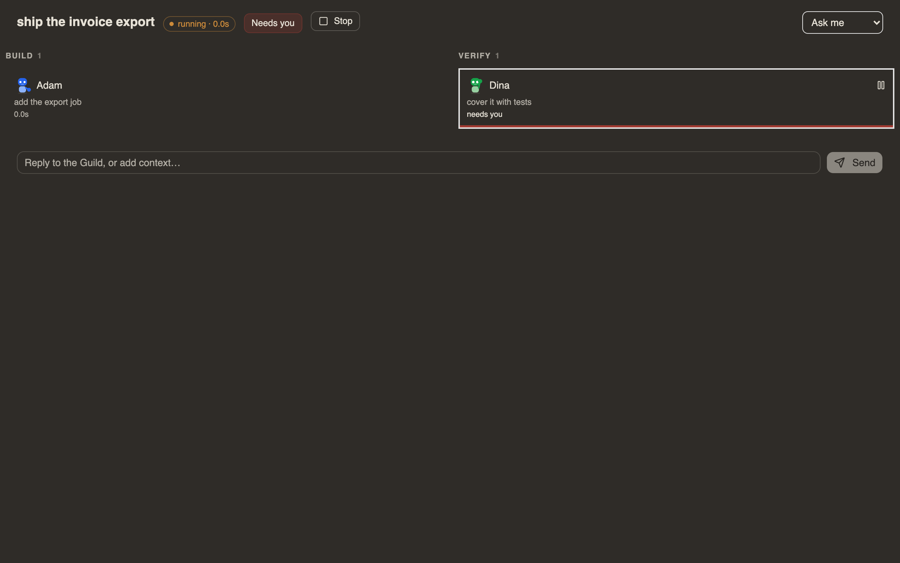

# Run your first delivery

Install the Guild on a Laravel app, ship one feature through the team, teach one rule, and read an eval scorecard. The five-minute path (install → first command → what you see) is the [README quickstart](../README.md#five-minute-quickstart).

Last verified 2026-08-19 against pack v1.43.0.

## Prerequisites

| Need | Why |
| --- | --- |
| A Laravel application you can open in Claude Code | This repository is the pack, not an app. Agents write migrations, Form Requests, Policies, and Pest/PHPUnit tests against *your* tree. |
| [Claude Code](https://docs.anthropic.com/en/docs/claude-code) (recommended) | Slash commands, subagents, and `/console` are Claude Code surfaces. Cursor loads the same plugin; Gemini and Codex are narrower — see [Install](../README.md#install). |
| Python 3.10+ on your `PATH` | Only if you open `/console`. `scripts/console/serve.py` refuses anything older. |
| Optional: Laravel Boost MCP | Agents prefer it when attached. Inert if absent. |

## 1. Install

Follow the [quickstart install](../README.md#1-install). Come back here when Claude Code lists the Guild commands (`/make-feature`, `/console`, `/teach`).

The plugin does **not** drop a `CLAUDE.md` into your app. Copy `CLAUDE.md.template` yourself, or use `install.sh`, which does.

## 2. Run your first delivery

From your Laravel project, pick a small, real slice — one model, one write path, no UI if you can help it. Use the [first command](../README.md#2-first-command); `--api` skips the frontend stage (`commands/make-feature.md`). Eval `teach-delivery` runs that same shape (`tests/eval/run-evals.sh`).

**What the quickstart does not spell out:**

1. Specialists by name: Elena (`database-developer`) first, then Adam (`backend-developer`) in parallel with Bella unless you passed `--api`, then Dina (`qa-engineer`) and Tariq (`tech-lead`).
2. Each specialist returns `STATUS / DID / VERIFIED / NOT-CHECKED / FLAGS / NEXT`. An empty `VERIFIED` is a claim — the orchestrator re-briefs.
3. Harvest (`docs/team/stack.md` and `docs/delivery/<name>/log.md` before the closing answer) was missing on command-driven runs until v1.41.0; it is in the shared Interface block now.

Want that pipeline as a browser board? `/console`. Stations take the dark floor as the company starts; a parked agent is marked (cue / needs you) — there is no amber bar. Every Bash call asks you — including read-only ones (`commands/console.md`).



Fixture-driven capture of the Guild console company floor (Adam + Dina, parked cue) — not a billed live `/console` run.

## 3. Teach the first rule

Pick a preference Laravel would not choose on its own. The teach-delivery case used ULID primary keys and integer cents (`docs/examples/team-memory/`).

```
/teach New tables use ULID primary keys, never auto-increment integers — sortable and non-enumerable
```

Expected: `docs/team/conventions.md` is created or appended with one entry (`commands/teach.md`):

```markdown
## Use ULID primary keys
- **Rule:** New tables use ULID primary keys, never auto-increment integers.
- **Why:** sortable and non-enumerable
- **Scope:** database-developer + backend-developer (migrations, models)
- **Source:** user, 2026-08-19
```

The command prints the recorded entry and the agents it binds. It takes effect on each agent's **next** invocation.

Then run another small `/make-feature`. The override is real when the migration diverges from Laravel's default *and says so*. The captured receipt is [`docs/examples/team-memory/donations-migration.php`](examples/team-memory/donations-migration.php) — `$table->ulid('id')->primary()` and `amount_cents`, with a docblock that names the ledger.

Do not record what the repo already enforces (Pint, `CLAUDE.md` constraints). Point at those instead.

## 4. Read an eval scorecard

The pack is scored against a planted-flaw fixture (`tests/eval/`, how-to in [`tests/eval/README.md`](../tests/eval/README.md)). Findings docs live in [`docs/evals/`](evals/). You do not need to run a billed eval to adopt the pack. You do need to read one scorecard so a later "it regressed" conversation has a shared table.

Open the newest dated file in `docs/evals/` — as of this writing, [run 9](evals/2026-08-18-run-9.md) (orchestration-contract pin) and the fuller table in [run 7](evals/2026-08-06-run-7.md). Harvest on that run was read on disk. The 10/10 closing-contract greps matched a specialist quoted into the reconstructed log, not an orchestrator close — [run 9 cost](evals/2026-08-19-run-9-cost.md).

| Column | Meaning |
| --- | --- |
| **Case** | Command under eval. Default sweep is five cases: `n-plus-one`, `policy`, `action`, `tests`, `hygiene` (`ALL_CASES` in `tests/eval/run-evals.sh`). `feature`, `teach`, `teach-delivery` are opt-in. |
| **Checks** | Answer-key hits / total. Artifact checks beat transcript greps. Inventory of every check: [check audit](evals/2026-08-06-check-audit.md). |
| **Judge** | Advisory rubric (`EVAL_JUDGE=1`). Never changes the check count or exit code. A disagreement in either direction is the interesting row. |
| **Seconds / Tokens / USD** | Three ceilings. When they disagree, **`max_usd` is the metric of record** (`tests/eval/baseline.json`, README eval section). |

A failing check is signal, not automatically a harness bug. Run 7's `action` 0/4 and the default-sweep misses were recorded as pre-existing, out of that milestone's scope.

To run the harness yourself (billed, minutes per case, not CI):

```bash
./tests/eval/run-evals.sh --list
# illustrative — real `claude -p` calls, costs money
# ./tests/eval/run-evals.sh              # five default cases
# EVAL_JUDGE=1 ./tests/eval/run-evals.sh feature
```

## Troubleshooting

These failed for real people (or real evals). Imagined first-week problems are not listed.

| What you see | What it is | What to do |
| --- | --- | --- |
| No `docs/team/stack.md` / no delivery log after `/make-feature` | Harvest used to live only in `delivery-coordinator.md`, which command-driven runs never load. Fixed in v1.41.0. | Pack older than 1.41.0 → update. On 1.41+ → the run delegated fewer than two specialists (harvest is gated on ≥2). |
| Plugin installed, no `CLAUDE.md` | By design. | Copy `CLAUDE.md.template`, or use `install.sh`. |
| `/console` parks on `echo hello` / `git status` | Every Bash call is forced through the browser. | Allow once, or Allow always for that exact command this run (`commands/console.md`). |
| Tests written, never run; agent in a fresh worktree | `isolation: worktree` has no `vendor/`. Eval run 4 caught this. The pack forbids that flag. | Do not add `isolation: worktree` to an agent. |
| Codex has no Adam / no `/make-feature` | Codex Core is the conventions skill + 4 guardrail hooks. The 17-agent team is Claude Code / Gemini. | Use Claude Code for the full team. |
| Gemini has no `/console` or `/board` | Generator skips those two commands (`scripts/check_inventory_sync.py`, `GEMINI_SKIPPED_COMMANDS`). | Use Claude Code for the web console. |

## Next

- Design and install flavours: [README](../README.md)
- What each `docs/` folder is: [docs index](README.md)
- How reviewers stay read-only: [read-only by design](read-only-by-design.md)
